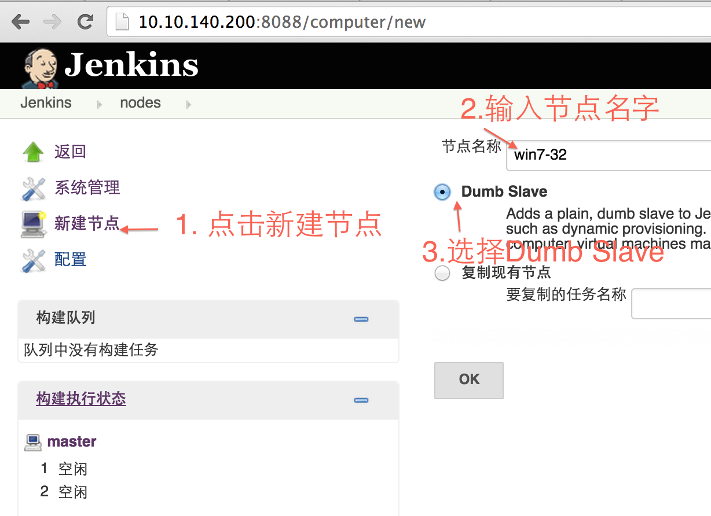
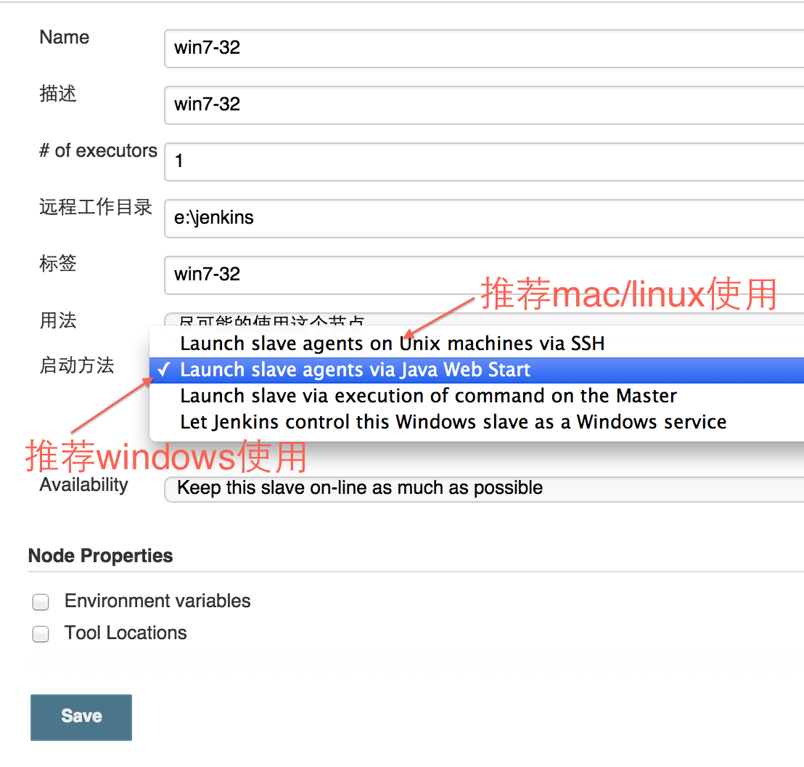
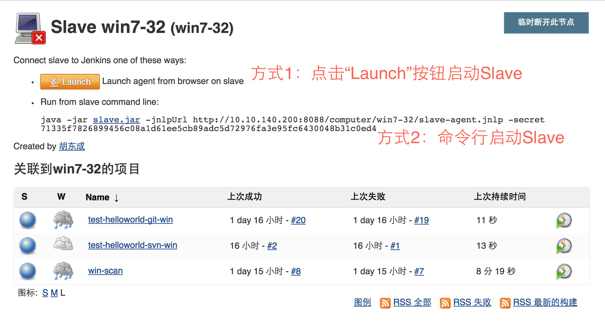
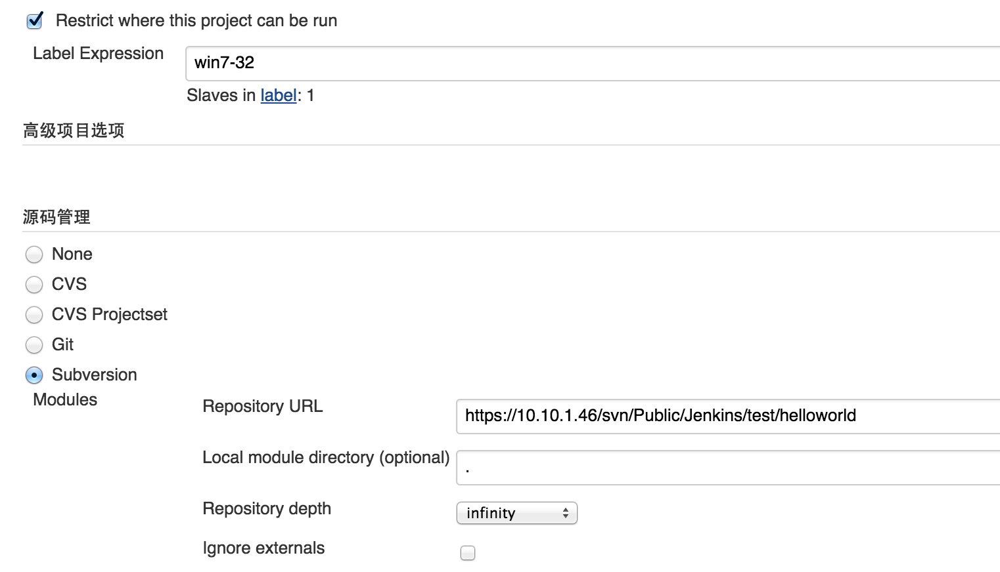
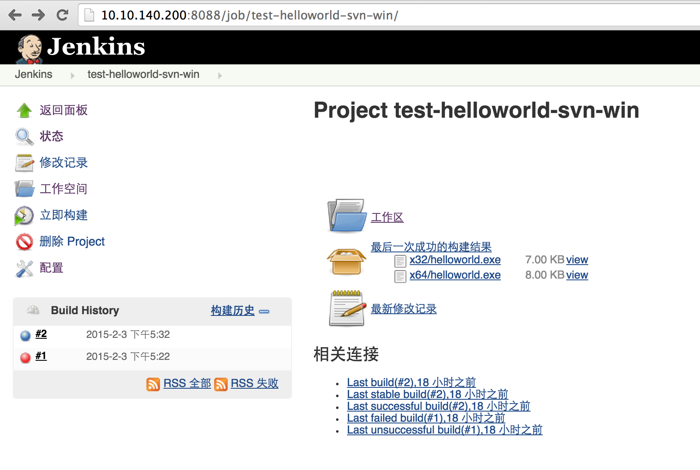

# Jenkins配置笔记

## 服务器安装
### Debian/Ubuntu
主页上有各种安装包下载，我们安装在Debian的服务器上，参考
http://pkg.jenkins-ci.org/debian/

This is the Debian package repository of Jenkins to automate installation and upgrade. To use this repository, first add the key to your system:
```
wget -q -O - http://pkg.jenkins-ci.org/debian/jenkins-ci.org.key | sudo apt-key add -
```

然后增加下面记录到你的```/etc/apt/sources.list```:
```
deb http://pkg.jenkins-ci.org/debian binary/
```
Update your local package index, then finally install Jenkins:
```
sudo apt-get update
sudo apt-get install jenkins
```
### Windows
windows安装比较简单，下载安装最新[安装包](http://mirrors.jenkins-ci.org/windows/latest)。

### 地址端口
Jenkins默认使用的是8080，但我的8080被其他程序占用了，我只能用8088，后续我可能会用nginx转到80端口。
浏览器打开http://10.10.140.200:8088/，可以看到安装结果。

### 插件安装
Jenkins默认没有安装git插件，所以我们需要手动安装git、gitlab插件。

### 权限管理
Jenkins默认没有开启权限管理，所有人都可以访问服务，我这里已经启动权限管理，请大家用邮箱注册账号。

## 新建节点(Slave)


## 配置节点


### 远程工作目录
* Windows目录```e:\jenkins```
* Linux目录```/var/jenkins```

### 启动方式：
* windows推荐使用Java Web Start；
* Mac OS X/Linux推荐使用SSH。
需要在节点上创建SSH登录的用户，服务器通过ssh登录到节点，下载并运行slave.jar。

## 启动节点


### Java Web Start
有两种方式启动java web start的节点：
* 点击“Launch”按钮启动
* 命令行输入java命令启动

### Windows服务启动Java Web Start
先从上面的方式启动节点，在程序文件菜单点击“安装到windows服务”，这样下次节点随windows启动而启动。

### SSH
SSH方式种配置正确的时候就可以自动启动。


### 系统信息
* System Properties
* Environment Variables

第二个环境变量比较重要，因为不用用户有不一样的环境变量，而Jenkins经常是以另一个用户运行，导致的问题是，我本地测试是可以的，但在Jenkins却构建不了。
比如，```Path```下没有找到git命令，无法clone代码；编译WIA时，没有设置```WDK7600ROOT```。

## 项目

项目类型有好几个，我们一般用```构建一个自由风格的软件项目```，这个类型需要手动配置所有的信息。

### 设置构建的节点
如果是Windows项，把```Restrict where this project can be run```设置为刚刚创建的```win7-32```；
如是Mac OSX项，设置为```hdc-macbook```。

### 源码管理
设置Subversion URL```https://10.10.1.46/svn/Public/Jenkins/test/helloworld```
如果需要用户验证，Jenkins会提示用户输入用户名和密码。

### 构建触发器
有很多条件可以触发构建，我们暂时不用，我们现在是手动构建。
* 触发远程构建 (例如,使用脚本)
* Build after other projects are built
* Build periodically
* Build when a change is pushed to GitLab.
* Poll SCM

### 构建
可以添加4种构建步骤：
* Execute Windows batch command
* Execute shell
* Invoke ant
* Invoke top-level Maven targets

对于windows项目，我们添加两个```Execute Windows batch command```，分别运行```build.bat```和```copyfile.bat```。
对于Mac Linux项目，我们添加两个```Execute shell```，分别运行```build.sh```和```copyfile.sh```。

build.bat的内容：
```
call "C:\Program Files\Microsoft Visual Studio 9.0\VC\vcvarsall.bat"
msbuild /t:Rebuild /p:Configuration=Release /p:Paltform=Win32
msbuild /t:Rebuild /p:Configuration=Release /p:Platform=x64
```

copyfile.bat的内容：
```
echo 创建路径
mkdir OutPut
mkdir OutPut\PushScan
mkdir OutPut\PushScan\x32
mkdir OutPut\PushScan\x64

echo 拷贝文件
copy Release\helloworld.exe OutPut\PushScan\x32\helloworld.exe
copy x64\Release\helloworld.exe OutPut\PushScan\x64\helloworld.exe
```

### 构建后操作
同样可以添加很多构建后操作，如：
* Build other projects
* Archive the artifacts
* Git Publisher
* E-mail Notification

我们现在只添加第二项```Archive the artifacts```，归档生成物。
从```copyfile.bat```脚本可以看出，我们把生成文件拷贝到```OutPut```目录下，所以设置```用于存档的文件```为```OutPut\**\*```。

## 运行构建
经过上面的设置后，可以点击```立即构建```进行构建，可以在```Console Output```查看详细日志输出。


